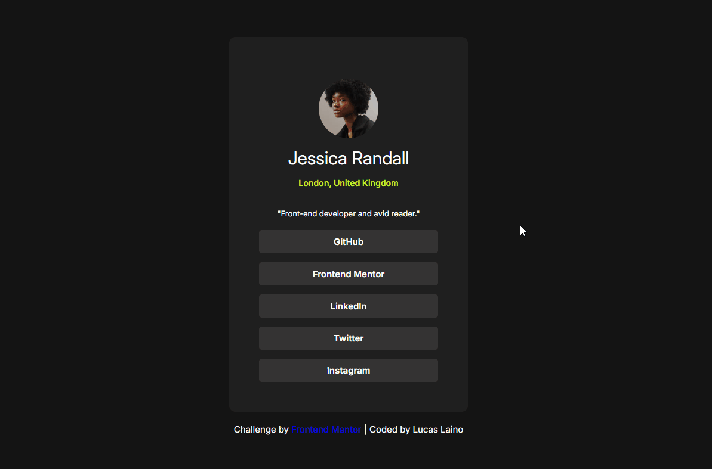

# Frontend Mentor - Social links profile 

Essa é a solução do [Social links profile on Frontend Mentor](https://www.frontendmentor.io/challenges/social-links-profile-UG32l9m6dQ).

## Conteúdo

- [Visão Geral](#visão-geral)
  - [O Desafio](#o-desafio)
  - [Screenshot](#screenshot)
  - [Links](#links)
- [Meu Processo](#meu-processo)
  - [Construído com](#construído-com)
- [Autor](#autor)

## Visão Geral

### O Desafio

- O desafio constitui em construir o projeto com os designs fornecidos pelo frontend mentor chegando o mais perto possível do design original. No projeto nós podemos usar qualquer tipo de ferramenta para ajudar a concluir o desafio.

### Screenshot

### Links

- Live Site URL: [Social links profile](https://lucaslaino.github.io/frontend-mentor-social-links-profile/)

## Meu Processo

### Construído com

- HTML
- CSS
- Flexbox
- [Google Fonts](https://fonts.google.com/) - Para fonte

## Autor

- LinkedIn - [Lucas Laino](https://www.linkedin.com/in/lucaslaino/)
- Frontend Mentor - [@Lucas Laino](https://www.frontendmentor.io/home)
